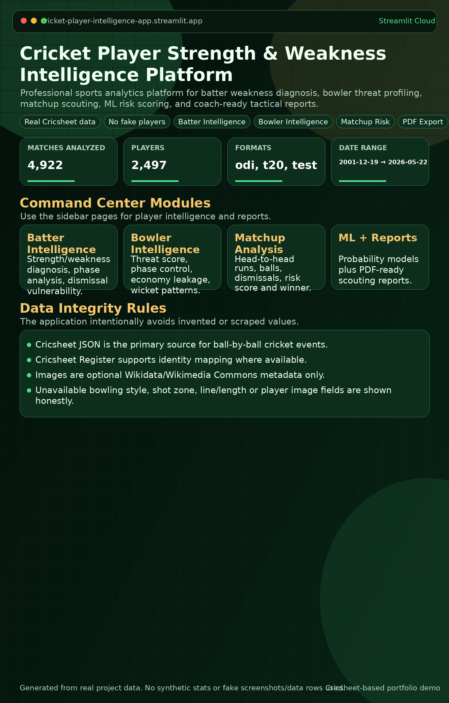
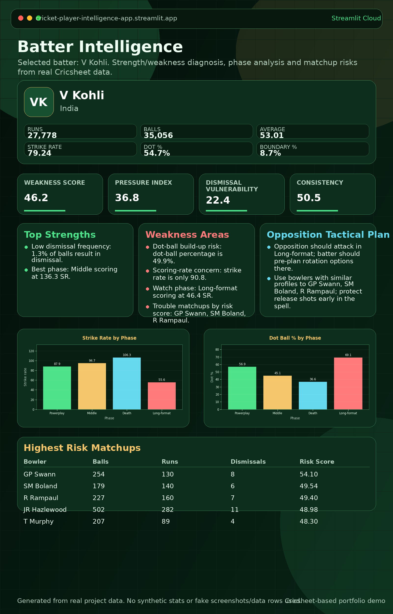
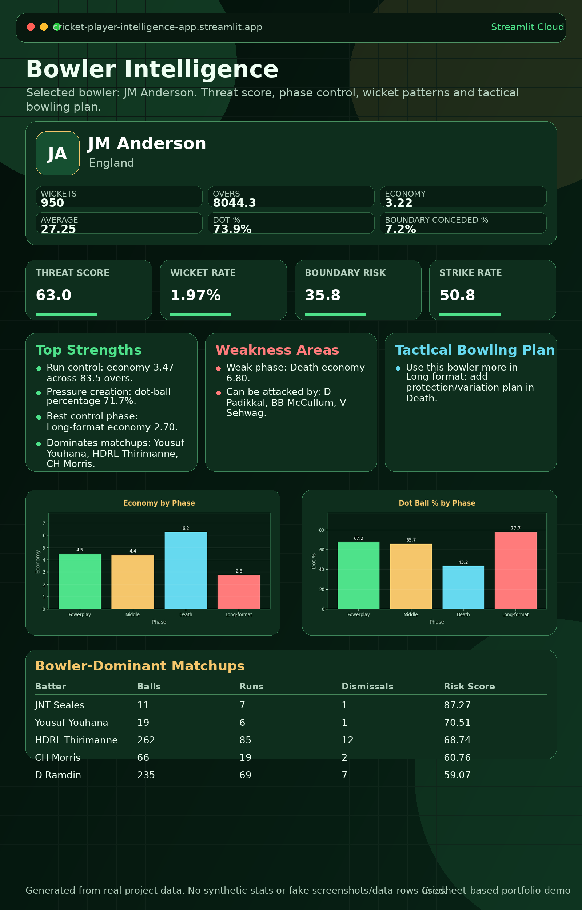
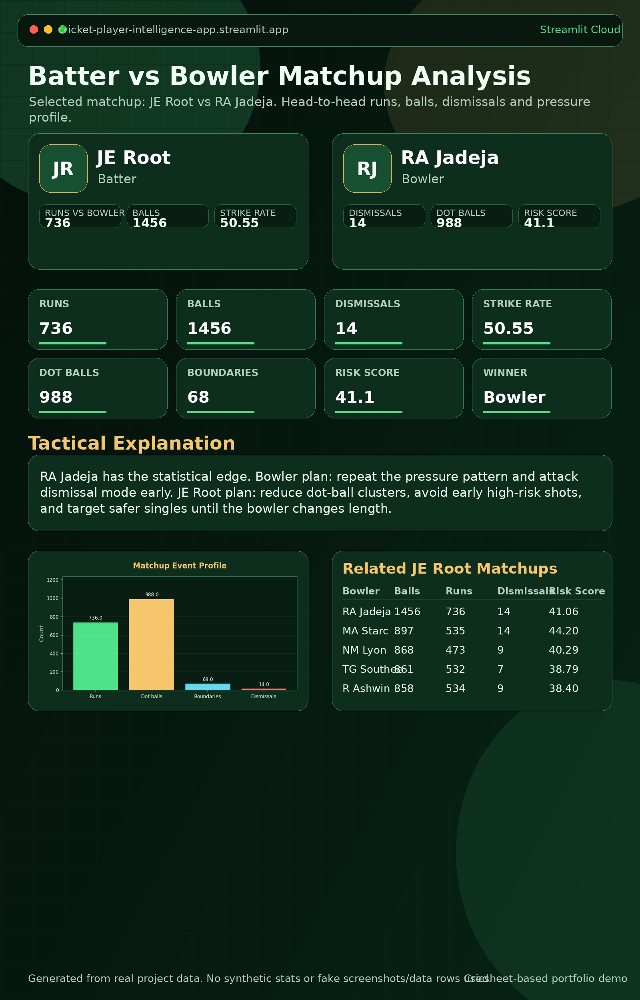
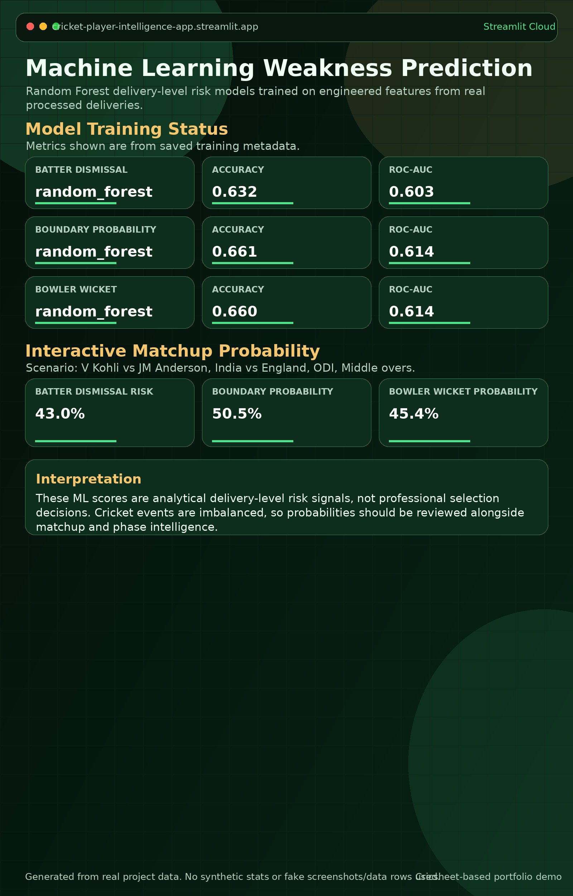
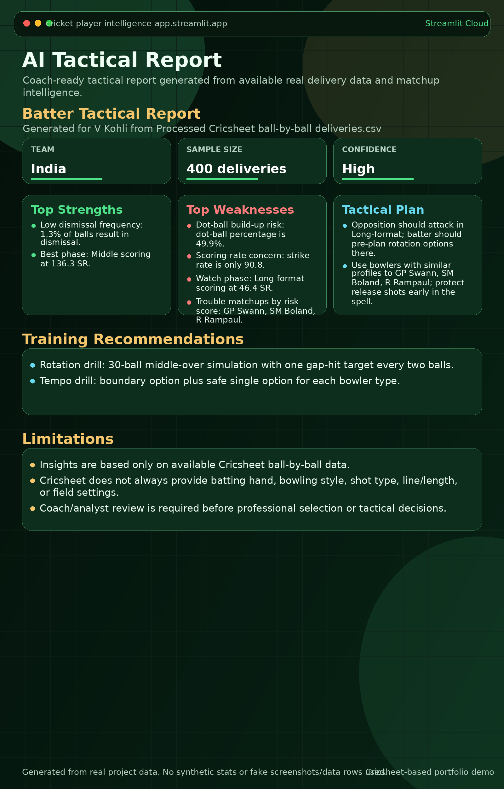
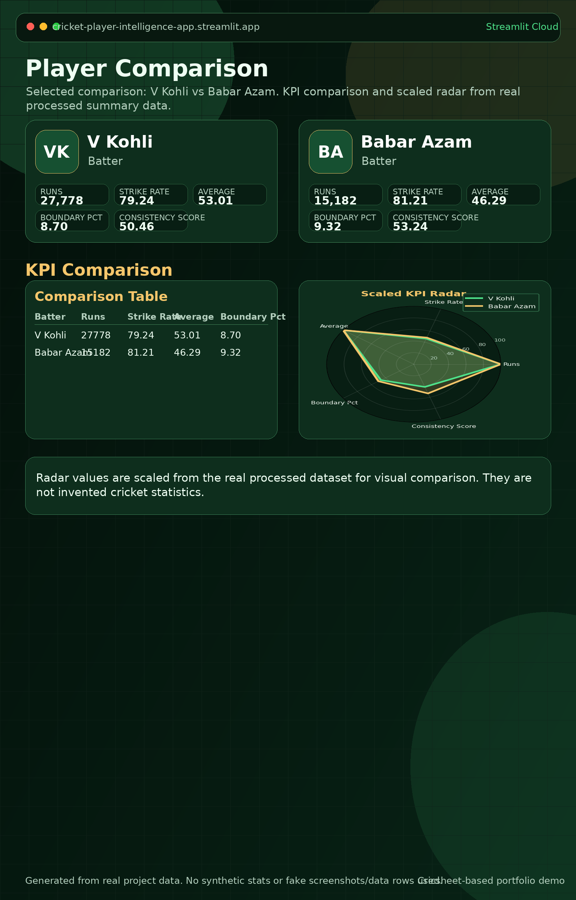
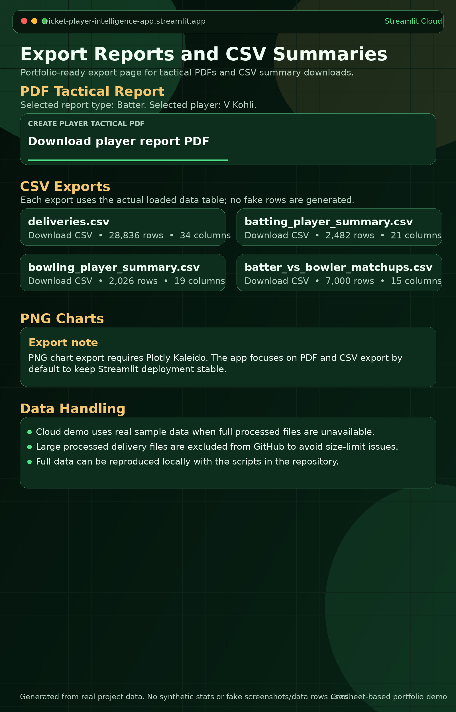

# 🏏 Cricket Player Strength & Weakness Intelligence Platform


A professional real-data cricket analytics platform for **batter weakness diagnosis**, **bowler threat profiling**, **head-to-head matchup intelligence**, **machine-learning risk scoring**, and **coach-ready tactical reports**.

This project is designed as a data science / sports analytics portfolio project. It uses real Cricsheet-derived cricket data and does **not** create fake players, fake statistics, fake screenshots, or synthetic cricket records.

---

## Live Demo

- **Streamlit App:** `add-link-after-deployment`
- **GitHub Repository:** `add-link-after-upload`
- **Demo Video:** optional

---

## Screenshots

> Screenshots are intentionally not fabricated. Run the app locally, capture each page, and save the images at the paths below.










Screenshot target paths:

```text
assets/screenshots/home.png
assets/screenshots/batter_intelligence.png
assets/screenshots/bowler_intelligence.png
assets/screenshots/matchup_analysis.png
assets/screenshots/ml_predictions.png
assets/screenshots/ai_tactical_report.png
assets/screenshots/player_comparison.png
assets/screenshots/export_report.png
```

---

## Problem Statement

Coaches, analysts, scouts, franchises, commentators, academies, and player agents need fast, evidence-based ways to identify:

- player strengths and weaknesses,
- phase-by-phase performance,
- batter-vs-bowler matchup risks,
- tactical bowling or batting plans,
- ML-backed delivery-level risk signals,
- exportable intelligence reports for review.

This platform converts ball-by-ball cricket data into practical player intelligence for scouting, tactical planning, commentary preparation, and portfolio-grade analytics demonstration.

---

## Key Features

- **Executive dashboard** with match, player, format, and date-range summary.
- **Batter intelligence** for scoring profile, pressure index, weakness score, phase trends, dismissals, and bad matchups.
- **Bowler intelligence** for wickets, economy, dot-ball pressure, threat score, boundary risk, phase control, and vulnerable batters.
- **Batter vs bowler matchup analysis** with runs, balls, dismissals, strike rate, risk score, matchup winner, and ball-by-ball events.
- **ML predictions** for batter dismissal risk, boundary probability, and bowler wicket probability.
- **AI tactical report** generated from deterministic analytics rules over real data, including strengths, weaknesses, tactical plan, and training recommendations.
- **Player comparison** with KPI tables and scaled radar charts.
- **PDF / CSV export** for coach-ready reports and processed summary tables.
- **Real-data integrity handling**: unavailable metadata is shown honestly as `Data not available`.

---

## Real Data Source

- **Cricsheet ball-by-ball data** is the primary match-event source.
- **Cricsheet Register** is used for player identity mapping where available.
- **Wikidata / Wikimedia Commons** are used only for optional player image metadata.
- **No fake data** is created.
- **No Google Images scraping** is used.
- Missing batting hand, bowling style, shot type, line/length, field placement, pitch-map, or image metadata is displayed honestly as **Data not available**.

---

## Dataset Summary

The full local dataset discovered in the uploaded ZIP contains:

| Dataset | Rows |
|---|---:|
| Deliveries | about 3,794,030 |
| Batters | 4,884 |
| Bowlers | 3,672 |
| Batter-vs-bowler matchups | 195,450 |
| Phase analysis rows | 20,931 |
| Venue analysis rows | 83,059 |
| Player metadata rows | 5,283 |

### Cloud Demo Sample Data

The repository includes `data/sample/` with small **real-row extracts** from the full project data. These samples let the app run on Streamlit Community Cloud without committing the 900MB+ processed delivery files.

The app automatically loads:

1. full files from `data/processed/` when available locally, otherwise
2. real sample files from `data/sample/` for cloud/demo mode.

---

## Example Insights from Real Data

These examples are taken from the real processed summary files in the ZIP, not invented values.

| Insight | Real example |
|---|---|
| Top batter by runs | **V Kohli** — 27,778 runs, 35,056 balls, 529 matches, average 53.01, strike rate 79.24 |
| Top bowler by wickets | **JM Anderson** — 950 wickets, 8,044.3 overs, 377 matches, economy 3.22, average 27.25 |
| High-volume matchup | **JE Root vs RA Jadeja** — 1,456 balls, 736 runs, 14 dismissals |

---

## ML Methodology

The ML layer uses real engineered delivery-level features from the processed Cricsheet data.

### Features

Typical model features include:

- batter,
- bowler,
- batting team,
- bowling team,
- match type,
- phase,
- over,
- innings.

### Targets

- `batter_dismissal` — whether the selected batter was dismissed on the delivery.
- `boundary_probability` — whether the batter hit a four or six.
- `bowler_wicket` — whether the delivery produced a bowler-attributed wicket.

### Model Type

- Random Forest classifier.

### Metrics Displayed

- Accuracy
- Precision
- Recall
- F1
- ROC-AUC

Cricket event prediction is naturally imbalanced: wickets and boundaries are sparse compared with normal deliveries. The ML scores should be treated as analytical risk signals, not final professional selection decisions.

---

## Tech Stack

- Python
- Streamlit
- Pandas
- NumPy
- Plotly
- Scikit-learn
- Joblib
- ReportLab
- Pillow
- Requests

---

## Project Structure

```text
cricket-player-intelligence/
├── app.py
├── pages/
│   ├── 1_Batter_Intelligence.py
│   ├── 2_Bowler_Intelligence.py
│   ├── 3_Matchup_Analysis.py
│   ├── 4_ML_Predictions.py
│   ├── 5_AI_Tactical_Report.py
│   ├── 6_Player_Comparison.py
│   └── 7_Export_Report.py
├── src/
│   ├── data_loader.py
│   ├── feature_engineering.py
│   ├── metrics.py
│   ├── model_utils.py
│   ├── image_utils.py
│   ├── report_generator.py
│   ├── charts.py
│   └── ui_components.py
├── scripts/
│   ├── download_cricsheet_data.py
│   ├── process_cricsheet_data.py
│   ├── build_player_features.py
│   ├── fetch_player_images.py
│   └── train_models.py
├── data/
│   ├── raw/
│   │   └── .gitkeep
│   ├── processed/
│   │   └── .gitkeep
│   ├── sample/
│   │   ├── deliveries_sample.csv
│   │   ├── batting_player_summary_sample.csv
│   │   ├── bowling_player_summary_sample.csv
│   │   └── batter_vs_bowler_matchups_sample.csv
│   └── images/
│       └── .gitkeep
├── models/
│   ├── .gitkeep
│   ├── batter_dismissal_model.pkl
│   ├── boundary_probability_model.pkl
│   └── bowler_wicket_model.pkl
├── assets/
│   └── screenshots/
├── docs/
├── tests/
├── requirements.txt
├── runtime.txt
├── DEPLOYMENT.md
├── DATA_CARD.md
└── README.md
```

---

## Local Setup

```bash
python -m venv .venv
.venv\Scripts\activate   # Windows
# source .venv/bin/activate  # macOS/Linux
pip install -r requirements.txt
streamlit run app.py
```

The Streamlit entrypoint is:

```text
app.py
```

---

## Full Data Reproduction

The full processed data is excluded from GitHub because `data/processed/deliveries.csv` and `data/processed/ball_by_ball.csv` are each about 921MB in the uploaded ZIP. Reproduce full data locally with:

```bash
python scripts/download_cricsheet_data.py
python scripts/process_cricsheet_data.py
python scripts/build_player_features.py
python scripts/fetch_player_images.py
python scripts/train_models.py
streamlit run app.py
```

Generated local files include:

```text
data/processed/deliveries.csv
data/processed/ball_by_ball.csv
data/processed/batting_player_summary.csv
data/processed/bowling_player_summary.csv
data/processed/batter_vs_bowler_matchups.csv
data/processed/phase_analysis.csv
data/processed/venue_analysis.csv
data/processed/player_metadata.csv
models/*.pkl
models/*_metrics.json
```

---

## Streamlit Community Cloud Deployment

1. Push the cleaned project to GitHub.
2. Go to Streamlit Community Cloud.
3. Select the GitHub repository.
4. Set **Main file path** to:

```text
app.py
```

5. Confirm `requirements.txt` and `runtime.txt` are present.
6. Deploy.
7. For a free/cloud demo, use the included real sample files in `data/sample/`.
8. For the full dataset, use Git LFS or external storage instead of committing huge CSVs directly.

---

## GitHub Upload Commands

```bash
git init
git add .
git commit -m "Initial commit: Cricket Player Intelligence Streamlit app"
git branch -M main
git remote add origin YOUR_GITHUB_REPO_URL
git push -u origin main
```

---

## Screenshot Capture Instructions

```bash
streamlit run app.py
```

Then manually capture and save:

- Home dashboard → `assets/screenshots/home.png`
- Batter Intelligence page → `assets/screenshots/batter_intelligence.png`
- Bowler Intelligence page → `assets/screenshots/bowler_intelligence.png`
- Matchup Analysis page → `assets/screenshots/matchup_analysis.png`
- ML Predictions page → `assets/screenshots/ml_predictions.png`
- AI Tactical Report page → `assets/screenshots/ai_tactical_report.png`
- Player Comparison page → `assets/screenshots/player_comparison.png`
- Export Report page → `assets/screenshots/export_report.png`

Do not add stock images or mock screenshots. Use screenshots captured from the real running app.

---

## Large Data Handling Plan

### Excluded from normal GitHub commits

- `data/processed/deliveries.csv`
- `data/processed/ball_by_ball.csv`
- raw Cricsheet ZIP archives in `data/raw/`
- cache folders such as `__pycache__/` and `.pytest_cache/`
- local environments such as `.venv/`
- `.env` and Streamlit secrets
- generated `outputs/`

### Included for demo mode

- `data/sample/deliveries_sample.csv`
- `data/sample/batting_player_summary_sample.csv`
- `data/sample/bowling_player_summary_sample.csv`
- `data/sample/batter_vs_bowler_matchups_sample.csv`
- additional sample metadata tables used by the UI

### Optional full-data approaches

- Use **Git LFS** for large CSVs if the repository owner accepts LFS bandwidth/storage tradeoffs.
- Store full processed files in external storage and download them locally before running.
- Regenerate the full processed data using the scripts documented above.

---

## Limitations

Cricsheet does not always include batting hand, bowling style, shot type, line/length, field placements, pitch maps, wagon wheels, or verified player images.

This app does not invent unavailable values. Missing metadata is displayed as **Data not available**.

ML outputs are analytical risk signals for exploration and portfolio demonstration. They are not professional selection decisions, medical advice, betting advice, or guaranteed tactical recommendations.

---

## Portfolio Positioning

This project demonstrates end-to-end sports analytics engineering: real-data ingestion, feature engineering, player-level intelligence, matchup analytics, model training, Streamlit UI development, and deployment-ready project documentation.

It is suitable for a data science, machine learning, analytics engineering, or sports technology portfolio.

---

## Author

**Author:** Mukesh Kumar  
**GitHub:** `add-link`  
**LinkedIn:** `add-link`  
**Portfolio:** `add-link`
